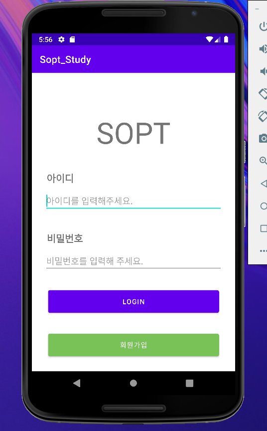
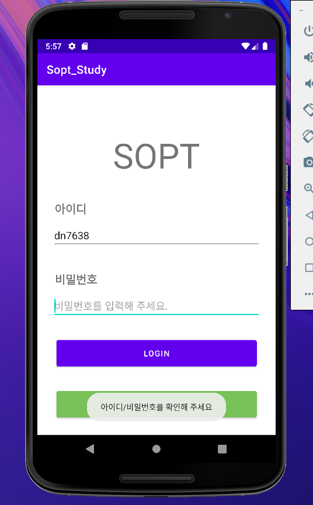
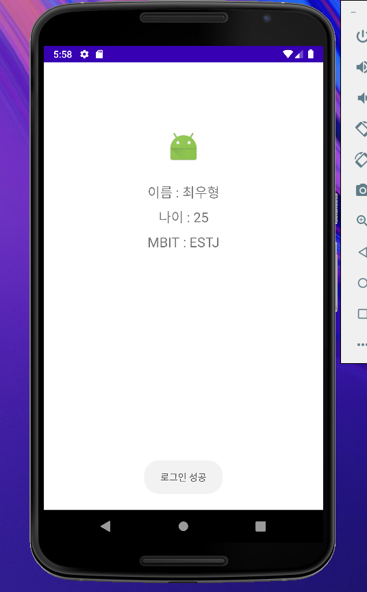
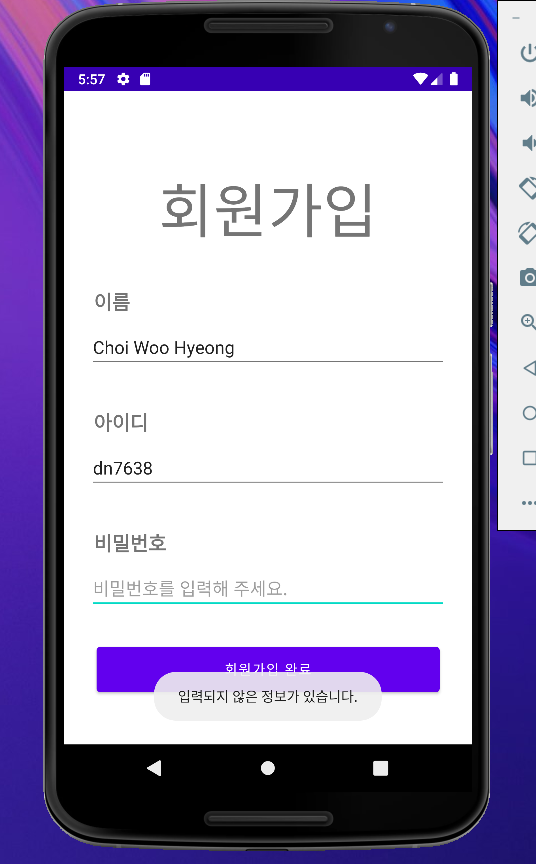

# Dead-Shot

> 잊지마, 우린 나쁜놈들이야.


# 1차 세미나

2022.04.08 - 필수 과제 완료 후 readme 작성!
2022.04.10 - readme 완료!
## 주요 코드 설명

### SignInActivity, activity_main (초기 화면이므로 xml 이름을 수정하지 않았음)

#### 로그인 버튼 -> HomeActivity로 이동
1.로그인 버튼 레이아웃
``` Kotlin
    <Button
        android:id="@+id/signUpButton"
        android:layout_width="346dp"
        android:layout_height="58dp"
        android:layout_marginTop="30dp"


        android:backgroundTint="@color/MYGREEN"

        android:text="회원가입"

        app:layout_constraintBottom_toBottomOf="parent"
        app:layout_constraintEnd_toEndOf="parent"
        app:layout_constraintStart_toStartOf="parent"
        app:layout_constraintTop_toBottomOf="@+id/logInButton"
        app:layout_constraintVertical_bias="0.0" />
```
버튼의 수평, 수직 크기는 비슷한 용도의 버튼들과 통일 되어 있습니다.
네 방향의 제약 조건들도 위 코드와 같습니다.
회원가입 버튼에는 '회원가입'이라는 텍스트가 들어가 있으며, 색상은 제가 추출한 초록색으로 변경 하였습니다. @color/MYGREEN을 values 하위 폴더에 myColor.xml 내에 정의 하여 활용 하였습니다. "@color/MYGREEN" 대신에 "#XXXXXX"(XX는 RGB값의 16진수 표현)를 활용할 수 있습니다.

``` Kotlin
<resources>

    <color name = "MYGREEN">#78C257</color>

</resources>
```
활용할 색상들을 직접 정의 한 후 활용할 수 있습니다.
버튼들의 style, theme 등을 미리 지정해서 많이 사용될 버튼들을 편하게 만들 수 있습니다.

2. 로그인 버튼, 회원 가입 버튼 클릭시 작동하는 SignInActivity의 코드
``` Kotlin
class MainActivity : AppCompatActivity() {
    private lateinit var binding : ActivityMainBinding
    override fun onCreate(savedInstanceState: Bundle?) {
        super.onCreate(savedInstanceState)

        binding = ActivityMainBinding.inflate(layoutInflater)
        setContentView(binding.root)

        binding.logInButton.setOnClickListener{

            val id = binding.editTextId.text.toString()
            val password = binding.editTextPassword.text.toString()

            //항목을 다 채우지 않았을 경우 토스트 메시지 띄우기
            if(id.isEmpty() || password.isEmpty() ){
                Toast.makeText(this, "아이디/비밀번호를 확인해 주세요", Toast.LENGTH_SHORT).show()
            }
            //다 채워진 경우 HomeActivity 로 이동
            else{
                Toast.makeText(this, "로그인 성공", Toast.LENGTH_SHORT).show()
                val intent = Intent(this, HomeActivity::class.java)
                startActivity(intent)
            }
        }
        binding.signUpButton.setOnClickListener {
        val intent = Intent(this, SignUpActivity::class.java)
        startActivity(intent)
        }
    }
}
```
ActivityMainBinding으로부터 binding 객체를 생성합니다.
logInButton에 리스너를 달아줍니다.
id, password 변수를 만들고 채워져 있는 텍스트를 확인하는 코드를 if함수를 이용하여 작성하였음.

signButton에 리스너를 달아줍니다.
Intent 를 통해 signUpActivity를 불러옵니다.


#### 비밀번호를 적는 EditTextView에서 입력 내용 가리기
``` Kotlin
android:inputType="textPassword"
```
EditText 레이아웃 작성시 위 코드를 추가하여 입력 내용을 가려줍니다.

#### EditTextView에 미리보기 글씨 넣기
``` Kotlin
android:hint="비밀번호를 입력해 주세요."
```
EditText 레이아웃 작성시 위 코드를 추가하여 미리보기 글씨를 넣어 줍니다.

### SignUpActivity, activity_sign_up

#### 회원가입 버튼 -> SignInActivity로 이동
``` Kotlin
class SignUpActivity : AppCompatActivity() {
    private lateinit var binding : ActivitySignUpBinding
    override fun onCreate(savedInstanceState: Bundle?) {
        super.onCreate(savedInstanceState)


        binding = ActivitySignUpBinding.inflate(layoutInflater)
        setContentView(binding.root)

        binding.finishSignUpButton.setOnClickListener {

            val name = binding.EditTextName.text.toString()
            val id = binding.editTextId.text.toString()
            val password = binding.editTextPassword.text.toSet()

            //항목을 다 채우지 않았을 경우 토스트 메시지 띄우기
            if(name.isEmpty() || id.isEmpty() || password.isEmpty() ){
                Toast.makeText(this, "입력되지 않은 정보가 있습니다.", Toast.LENGTH_SHORT).show()
            }

            //다 채워진 경우 회원 가입 페이지 종료
           else {
                finish()
            }
        }

    }
}
```
MainActivity(파일명 SignInActivity)와 대부분 동일한 코드.
이름을 적을 name변수 추가.

### HomeActivity, activity_home

#### HomeActivity
``` Kotlin
class HomeActivity : AppCompatActivity() {
    private lateinit var binding : ActivityHomeBinding
    override fun onCreate(savedInstanceState: Bundle?) {

        super.onCreate(savedInstanceState)
        
        binding = ActivityHomeBinding.inflate(layoutInflater)
        setContentView(binding.root)
    }
}
```
Activity_home 레이아웃 파일과 연결시킬 binding 변수를 만들어 줍니다.

### activity_home
``` Kotlin
    <ImageView
        android:id="@+id/imageView_profile"
        android:layout_width="wrap_content"
        android:layout_height="wrap_content"
        android:layout_marginTop="100dp"

        app:layout_constraintEnd_toEndOf="parent"
        app:layout_constraintStart_toStartOf="parent"
        app:layout_constraintTop_toTopOf="parent"

        app:srcCompat="@android:mipmap/sym_def_app_icon" />
```
activity_home 에 쓰인 ImageView에 대한 코드 입니다.
C:\Users\gua05\AppData\Local\Android\Sdk\platforms\android-32\data\res\mipmap-hdpi\sym_def_app_icon.png 에 있는 이미지 파일을 프로필 사진으로서 활용 하였습니다.

## 프로그램 실행 화면

### 메인화면


### 메인화면_토스트


### 홈 화면


### 회원가입 실패

